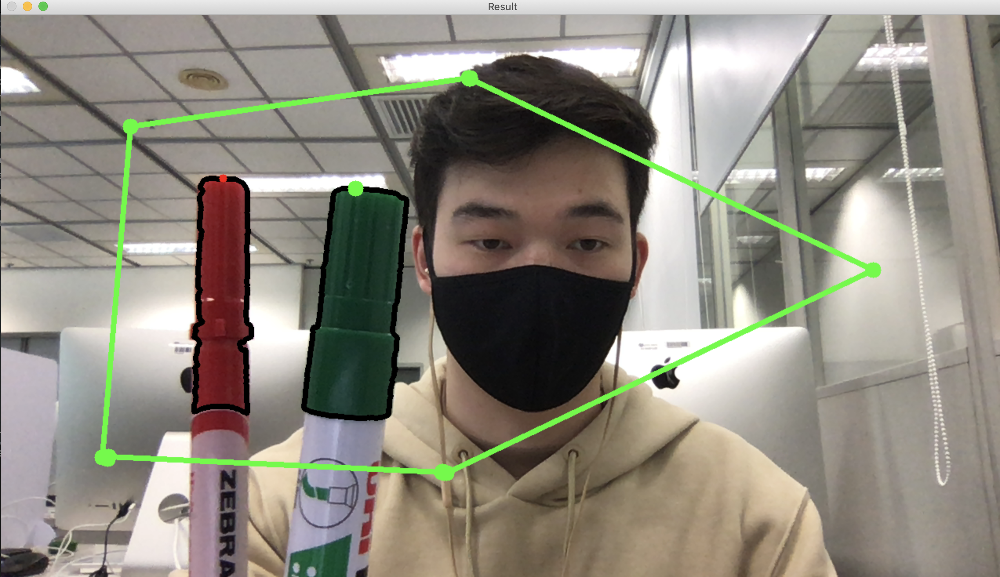

# Virtual-Drawing
Application to detect the object based on specific color range, contour detection and drawing. OpenCV library was used.

In the code, 2 colors' parameters are provided to detect them and apply the mask with upper and lower limits to original frames. The color range can be extended. 

Functionality:
  - Get contours of the object
  - The 'marker' point is determined as middle of points in contour set and highest y value
  - The color of the 'marker' point is defined based on the object's color (if detected)
  - Press 'd' to start drawing (Drawing mode), the 'marker' point will leave a path. Pressing 'd' again will clean the screen and clean up the drawing points list.
  - The line becomes wider when the object closer to the webcam (it is based on the contour area)
  - Press 'r' to fix the point at the current position. As many points as you wish
  - Press 't' to connect all the fixed points. The shape/polygon will be dynamycally change when you add new fixed points. Press 't' again to delete the lines.
  - Press 'p' to clean the screen and 'q' to stop the application

